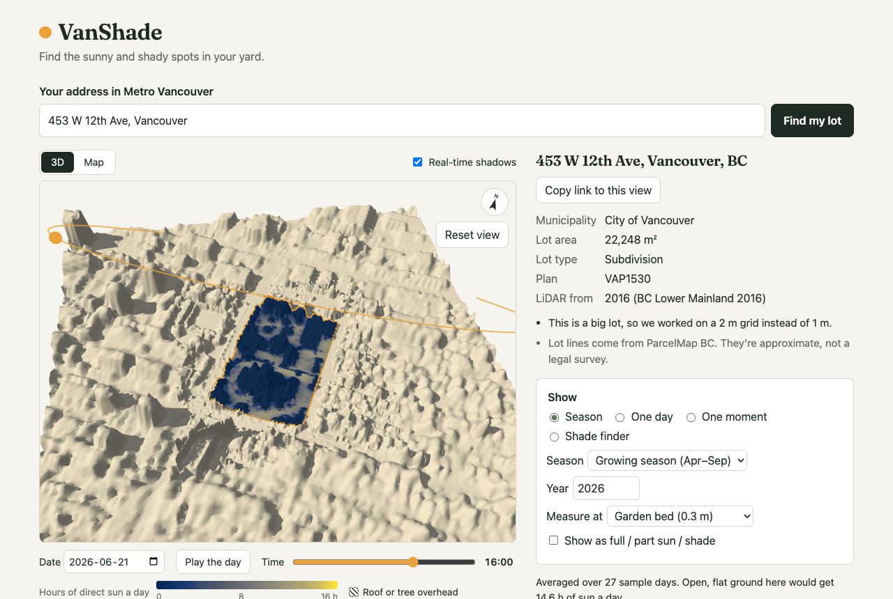
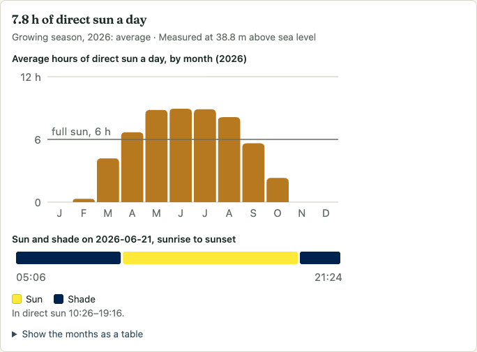
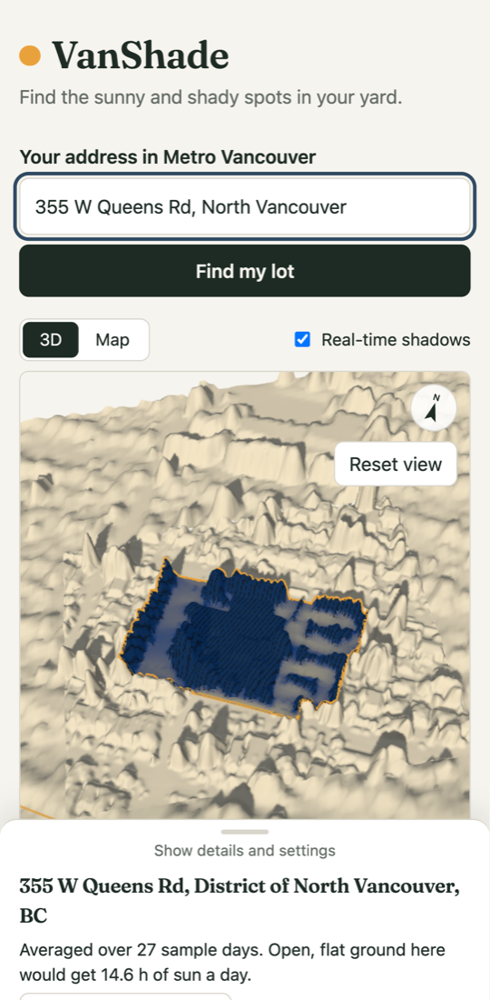

# VanShade

**Where does the sun fall on your lot?** Type a Metro Vancouver address and VanShade shows your lot in 3D, with its real
neighbours, trees and buildings, and works out how many hours of direct sun each square metre gets: right now, on any day, or
averaged over a season. Gardeners use it to find full-sun spots for vegetables; anyone can use it to find shade for a summer
afternoon.

**Live:** https://wattyven.github.io/VanShade/



<p>
  
  
</p>

## Using it

- **Search** for an address (Metro Vancouver only). VanShade finds the lot, loads the LiDAR around it and colours the lot by
  hours of direct sun.
- **Show:**
  - *Season* averages daily sun over a preset or custom range (the growing season by default).
  - *One day* gives the sun-hours for a single day.
  - *One moment* shows sun or shade at a time you pick.
  - *Shade finder* shows how often each spot is shaded in a daily time window (say 1–6 pm through summer).
- **Measure at** garden-bed height (0.3 m), seated (1.2 m) or on a roof or deck surface.
- **Full / part sun / shade:** classes with adjustable thresholds (6 h and 3 h by default).
- **Time slider and Play the day:** move the sun and its real-time shadows.
- **Click a spot**, or focus the view, step with the arrow keys and press Enter, to see that spot's average sun month by month
  and its sun/shade through the day.
- **Copy link to this view:** the address, lot, mode, dates and time are all in the URL.

## How it works

```
address ─▶ BC Address Geocoder (parcel point) ─▶ ParcelMap BC WFS (lot polygon)
        ─▶ NRCan HRDEM 1 m LiDAR surface (DSM) for the lot + 200 m, ground (DTM) near the lot
        ─▶ Web Worker: horizon precompute ─▶ SunCalc sun positions ─▶ hours of direct sun per cell
        ─▶ three.js view (true north up)
```

1. **Elevation.** Read straight from NRCan's Cloud-Optimized GeoTIFFs on S3 with geotiff.js range requests. There's no server
   and no API key. The surface model includes roofs, trees and hedges, which is where most yard shade comes from.
2. **Horizons.** For every 1 m cell on the lot and 180 compass directions, a worker marches out across the surface model and
   records the highest angle anything blocks. Big lots split this across helper threads.
3. **Sun.** Each sun position (SunCalc, America/Vancouver time) becomes a table lookup per cell. A whole season is about
   1,500 positions and takes milliseconds.
4. **Grid north isn't true north.** The elevation grid (EPSG:3979) is rotated about 25° from true north in Vancouver.
   VanShade computes that per lot and applies it everywhere, from sun directions to drawing.

The engine is covered by tests for:
- solar-noon altitudes
- the shadow length and direction of a 10 m box
- true-north shadows in the real projection
- horizon lookups against brute-force ray marching (≥ 99% agreement)
- identical results in any time zone

## Accuracy, in short

- Lot lines come from ParcelMap BC and are approximate, not a legal survey.
- The LiDAR has a date: most of Metro Vancouver is 2016. Newer buildings and tree growth aren't in it.
- Trees count as solid all year. Deciduous trees let more winter sun through.
- It's potential direct sun on clear days, not adjusted for weather.
- Only things within about 200 m cast shadows, so distant hills aren't included.

The app's **About accuracy** panel has the details.

## Data and licences

| Data | Source | Licence |
|---|---|---|
| Addresses | BC Address Geocoder | Open Government Licence – British Columbia |
| Lot lines | ParcelMap BC (DataBC WFS) | Open Government Licence – British Columbia |
| Elevation | NRCan High Resolution Digital Elevation Model (HRDEM) 1 m mosaic | Open Government Licence – Canada |

Built with [three.js](https://threejs.org/), [SunCalc](https://github.com/mourner/suncalc),
[geotiff.js](https://geotiffjs.github.io/), [proj4js](https://github.com/proj4js/proj4js) and
[Luxon](https://moment.github.io/luxon/). Headings use [Fraunces](https://github.com/undercasetype/Fraunces) (SIL OFL).

Endpoint details, quirks and measurements are in [`docs/DATA_SOURCES.md`](docs/DATA_SOURCES.md).

## Development

```sh
npm ci
npm run dev          # http://localhost:5173/VanShade/
npm test             # Vitest
npm run test:tz      # the suite under TZ=UTC and TZ=Asia/Tokyo (as CI runs it)
npm run typecheck
npm run build
npm run smoke        # Playwright smoke test (BASE_URL=… to point at a deployed site)
```

The app is a static Vite + TypeScript site with no backend. Every push to `main` runs CI:
1. typecheck, both time-zone test runs, and build
2. deploy to GitHub Pages
3. the Playwright smoke test against the live site

| Path | What's there |
|---|---|
| `src/data/` | geocoder, ParcelMap BC, scope rules (Metro Vancouver jurisdictions) |
| `src/elevation/` | STAC lookup, pixel windows, COG reads, LiDAR vintage |
| `src/engine/` | cells, horizons, sun sampling, outputs; the worker protocol and client |
| `src/workers/` | the shade worker and its horizon helper threads |
| `src/scene/` | the three.js view (lazy-loaded) and its pure geometry helpers |
| `src/ui/` | search, controls, timeline, inspector, 2D map, design tokens |
| `tests/`, `e2e/` | Vitest unit tests (with captured API fixtures), the Playwright smoke test |
| `spike/` | the Phase 0 data probes and measurement scripts |
| `docs/` | data-source findings, screenshots |

