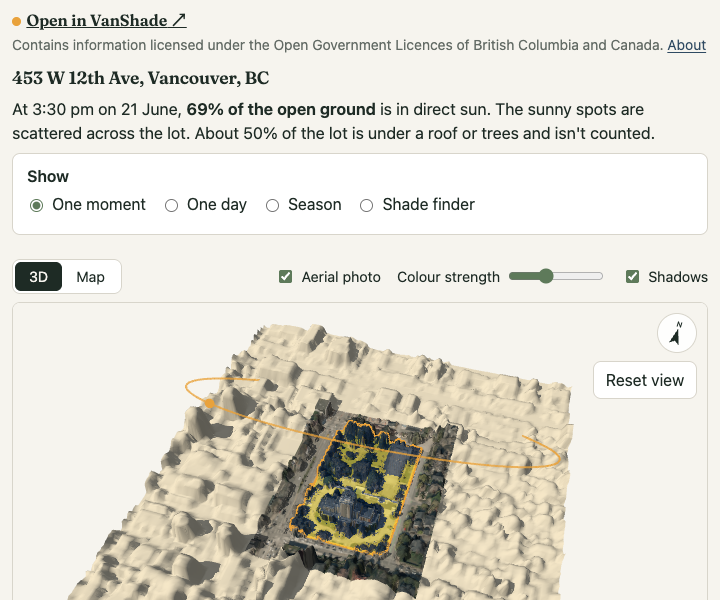

# VanShade

**Where does the sun fall on your lot?** Type a Metro Vancouver address and VanShade shows your lot in 3D, with its real
neighbours, trees and buildings, and works out how many hours of direct sun each square metre gets: right now, on any day, or
averaged over a season. Gardeners use it to find full-sun spots for vegetables; anyone can use it to find shade for a summer
afternoon.

**Live:** https://wattyven.github.io/VanShade/


<p>
  
  
</p>

## Using it

- **Search** for an address (Metro Vancouver only), or tap **Use my location** to start from where you're standing. VanShade
  finds the lot, loads the LiDAR around it and shows where the sun is falling right now. A sentence at the top sums it up,
  e.g. "At 3:30 pm on 21 June, 78% of the open ground is in direct sun." After dark it shows midday instead, and says so.
  First-time visitors get a short "How to read this" card, and the About panel explains the terms.
- **Show:**
  - *One moment* (the default) shows sun or shade now, or at a time you pick.
  - *One day* gives the sun-hours for a single day.
  - *Season* averages daily sun over a preset or custom range (the growing season by default), e.g. "Most of the open
    ground here gets 4.5–7.5 hours of direct sun a day (part sun) from April to September."
  - *Shade finder* shows how often each spot is shaded in a daily time window (say 1–6 pm through summer).
- **Measure at** garden-bed height (0.3 m), seated (1.2 m) or on a roof or deck surface.
- **Full / part sun / shade:** how One day and Season are coloured, with adjustable thresholds (6 h and 3 h); untick it
  for exact hours. The aerial photo is on by default where the municipality publishes one, with the colours at half
  strength over it.
- **Time slider, Now and Play the day:** move the sun and its shadows between sunrise and sunset (both shown).
- **Click a spot**, or focus the view, step with the arrow keys and press Enter, to see that spot's average sun month by month
  and its sun/shade through the day.
- **Elevation data:** where both surveys exist, choose *Best of both* (2016 detail, updated wherever something changed by
  2025; the default), *Newest survey* (2025, 1 m) or *Most detailed* (2016, 0.5 m). *Show changes since 2016* hatches what
  changed.
- **Aerial photo:** where the municipality publishes open orthophotos (Vancouver, Burnaby, Surrey, Coquitlam, the District of
  North Vancouver, Delta, Maple Ridge, both Langleys, Port Coquitlam, White Rock), drape the photo under the results, with a
  slider for the colours' strength.
- **Copy link:** the address, lot, mode, dates, time and photo setting are all in the URL. Shared links show a preview
  card in chat apps and social media.
- **Copy embed code:** an `<iframe>` for the current lot and time, for a blog or a garden club page. The embedded view is
  compact (the 3D view, the result, the modes and the time slider) with a link to the full site.

## Embed it

Put a live VanShade view on your own page, such as a blog post or a garden club site. Open a lot, choose the mode, date and
time, then press **Copy embed code**. You get an iframe like this one:

```html
<iframe src="https://wattyven.github.io/VanShade/#a=453+W+12th+Ave%2C+Vancouver%2C+BC&amp;m=moment&amp;d=2026-06-21&amp;t=15%3A30&amp;embed=1" width="100%" height="600" style="border:0" loading="lazy" title="VanShade: sun and shade at 453 W 12th Ave, Vancouver, BC"></iframe>
```

[](https://wattyven.github.io/VanShade/#a=453+W+12th+Ave%2C+Vancouver%2C+BC&m=moment&d=2026-06-21&t=15%3A30&embed=1)

GitHub doesn't run iframes in a README, so this is a picture of that embed; click it to open it live. The embed keeps the
3D view, the result, the modes and the time slider, credits the data, and links to the full site.

## How it works

```
address ─▶ BC Address Geocoder (parcel point) ─▶ ParcelMap BC WFS (lot polygon)
        ─▶ NRCan HRDEM 1 m LiDAR surface (DSM) for the lot + 200 m, ground (DTM) near the lot
        ─▶ Web Worker: horizon precompute ─▶ SunCalc sun positions ─▶ hours of direct sun per cell
        ─▶ three.js view (true north up)
        ─▶ then, in the background: a sharper or newer surface (NRCan point cloud at 0.5 m, or LidarBC 2024/2025 at 1 m),
           and the results swap over
```

1. **Elevation.** Read straight from NRCan's Cloud-Optimized GeoTIFFs on S3 with geotiff.js range requests. There's no server
   and no API key. The surface model includes roofs, trees and hedges, which is where most yard shade comes from.
2. **Horizons.** For every 1 m cell on the lot and 180 compass directions, a worker marches out across the surface model and
   records the highest angle anything blocks. Big lots split this across helper threads.
3. **Sun.** Each sun position (SunCalc, America/Vancouver time) becomes a table lookup per cell. A whole season is about
   1,500 positions and takes milliseconds.
4. **Sharper, newer LiDAR.** Once the first result is up, VanShade looks for better data for the lot. One source is NRCan's
   cloud-optimized point clouds: it reads only the octree nodes near the lot (3–8 MB, decoded with laz-perf in WebAssembly)
   and grids the highest return per 0.5 m. The other is the Province's 2024/2025 LidarBC surveys at 1 m. By default it
   combines them: the 2016 detail wherever the two surveys agree, and 2025 wherever something changed by more than 2.5 m
   (a new tower, a demolished house, trees removed). The heights are checked against NRCan's ground model before use.
5. **Grid north isn't true north.** The elevation grid (EPSG:3979) is rotated about 25° from true north in Vancouver.
   VanShade computes that per lot and applies it everywhere, from sun directions to drawing.

The engine is covered by tests for:
- solar-noon altitudes
- the shadow length and direction of a 10 m box
- true-north shadows in the real projection
- horizon lookups against brute-force ray marching (≥ 99% agreement)
- identical results in any time zone

## Accuracy, in short

- Lot lines come from ParcelMap BC and are approximate, not a legal survey.
- The LiDAR has a date. Most of Metro Vancouver is 2016 in the first result. Where the newer LidarBC surveys are available
  (2024–2025), they replace it. Anything built or grown since isn't in it.
- Trees count as solid all year. Deciduous trees let more winter sun through.
- It's potential direct sun on clear days, not adjusted for weather.
- Only things within about 200 m cast shadows, so distant hills aren't included.

The app's **About accuracy** panel has the details.

## Data and licences

| Data | Source | Licence |
|---|---|---|
| Addresses | BC Address Geocoder | Open Government Licence – British Columbia |
| Lot lines | ParcelMap BC (DataBC WFS) | Open Government Licence – British Columbia |
| Elevation | NRCan High Resolution Digital Elevation Model (HRDEM) 1 m mosaic, and CanElevation LiDAR point clouds | Open Government Licence – Canada |
| Newer elevation | LidarBC 1 m surface and ground models (2024, 2025), read through [a small CORS proxy](proxy/lidarbc) | Open Government Licence – British Columbia |
| Aerial photos | Each municipality's orthophoto service (list in the app's About panel) | Each municipality's Open Government Licence |

Built with [three.js](https://threejs.org/), [SunCalc](https://github.com/mourner/suncalc),
[geotiff.js](https://geotiffjs.github.io/), [proj4js](https://github.com/proj4js/proj4js),
[Luxon](https://moment.github.io/luxon/), [copc.js](https://github.com/connormanning/copc.js) and
[laz-perf](https://github.com/hobuinc/laz-perf). Headings use [Fraunces](https://github.com/undercasetype/Fraunces) (SIL OFL).

Endpoint details, quirks and measurements are in [`docs/DATA_SOURCES.md`](docs/DATA_SOURCES.md).

## Licence

The code is under the [MIT licence](LICENSE). The data VanShade reads stays under each provider's licence, listed in the
table above (the app shows the attribution each requires). The Fraunces typeface is under the SIL Open Font Licence
([`src/assets/fonts/OFL.txt`](src/assets/fonts/OFL.txt)), and the libraries keep their own licences.

## Development

```sh
npm ci
npm run dev          # http://localhost:5173/VanShade/
npm test             # Vitest
npm run test:tz      # the suite under TZ=UTC and TZ=Asia/Tokyo (as CI runs it)
npm run typecheck
npm run build
npm run smoke        # Playwright smoke test (BASE_URL=… to point at a deployed site)
```

A monthly workflow (`.github/workflows/refresh-index.yml`) rebuilds the high-resolution LiDAR file index and opens an
issue when new surveys appear.

The app is a static Vite + TypeScript site with no backend. The one optional exception is the LidarBC proxy in
[`proxy/lidarbc/`](proxy/lidarbc): deploy it once with `npx wrangler deploy`, then set the repository variable
`VITE_LIDARBC_PROXY`. Without it, the site skips LidarBC. Every push to `main` runs CI:
1. typecheck, both time-zone test runs, and build
2. deploy to GitHub Pages
3. the Playwright smoke test against the live site

| Path | What's there |
|---|---|
| `src/data/` | geocoder, ParcelMap BC, scope rules (Metro Vancouver jurisdictions) |
| `src/elevation/` | STAC lookup, pixel windows, COG reads, LiDAR vintage, point clouds and LidarBC (the sharper surfaces) |
| `src/imagery/` | municipal aerial photos: sources, fetching, placement |
| `proxy/lidarbc/` | the Cloudflare Worker that adds CORS headers to LidarBC |
| `src/engine/` | cells, horizons, sun sampling, outputs; the worker protocol and client |
| `src/workers/` | the shade worker and its horizon helper threads |
| `src/scene/` | the three.js view (lazy-loaded) and its pure geometry helpers |
| `src/ui/` | search, controls, timeline, inspector, 2D map, design tokens |
| `tests/`, `e2e/` | Vitest unit tests (with captured API fixtures), the Playwright smoke test |
| `spike/` | the Phase 0 data probes and measurement scripts |
| `docs/` | the developer guide, data-source findings, screenshots |

Contributor notes and gotchas are in [`docs/DEVELOPMENT.md`](docs/DEVELOPMENT.md).
